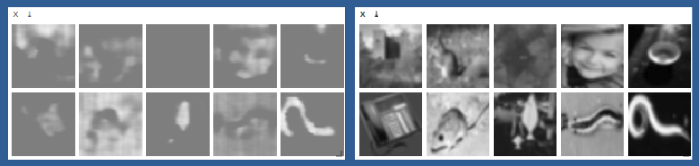
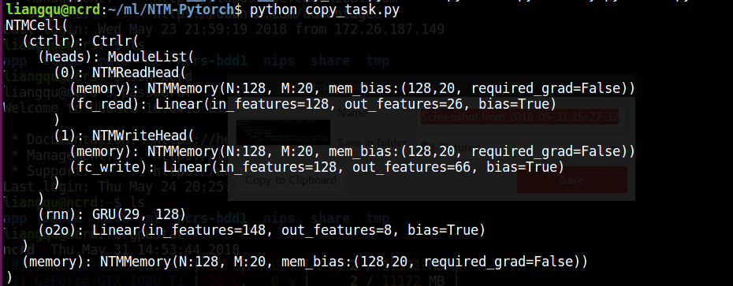

# NTM-Pytorch
Neural Turing Machine or Differentiable Neural Computer Implementation in Pytorch
Support CUDA accerleration.

# Platform
- python: 3.x
- pytorch: 0.4+

# Screenshot
- copy task: Left: Copied Images, Right: Initial Images, each image as 32 rows(sequence numbers) with 32 columns(sequence length).

- running print

# HOWTO

`python copy_task.py`

